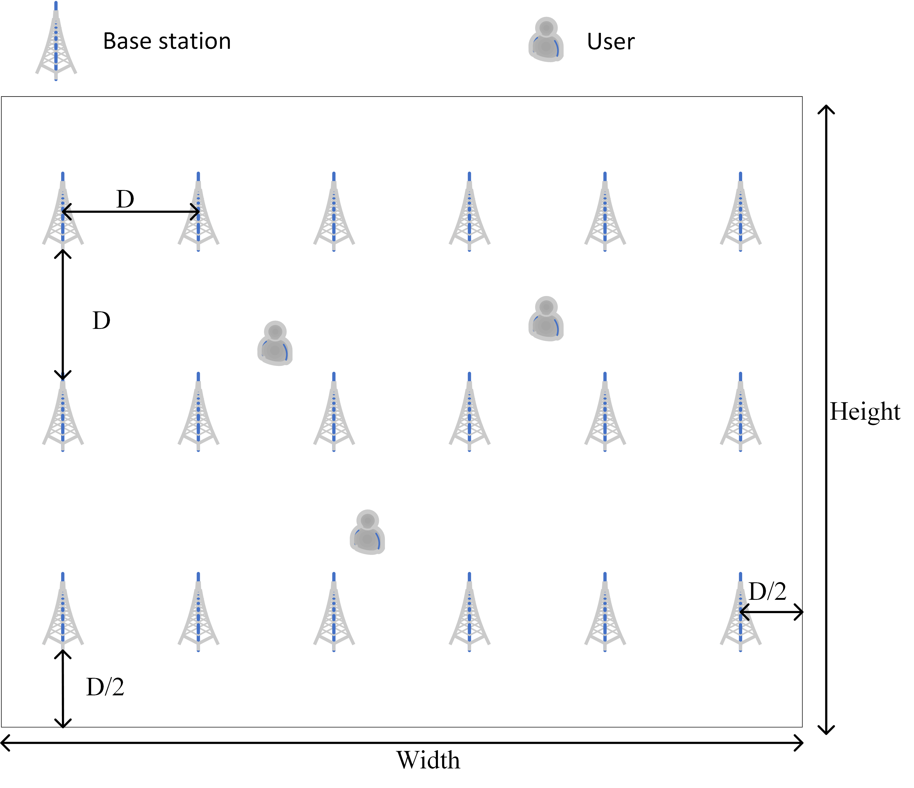
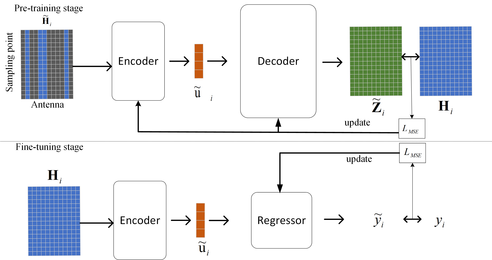

# Signal-Guided Masked Autoencoder for Wireless Positioning with Limited Labeled Samples
The code for the paper 

**Ji Wang, Wei Fang, Jian Xiao, Yi Zheng, Le Zheng and Fan Liu, “Signal-Guided Masked Autoencoder for Wireless Positioning with Limited Labeled Samples,” *IEEE Transactions on Vehicular Technology*, Early Access, Sep. 2024** 

Abstract—In this paper, a signal-guided masked autoencoder (S-MAE) based semi-supervised learning framework is proposed for high-precision positioning with limited labeled channel impulse response (CIR) samples. To release the overfiting effect of the neural network under insufficient labeled samples, we design a two-stage training strategy based on the proposed S-MAE
model, which can be divided into pre-training and fine-tuning stage. In the pre-training stage, we design an effective masking pattern in the antenna domain to learn the latent representation of CIR by utilizing a large number of unlabeled CIR samples. Besides, we introduce the channel attention mechanism to enhance
the feature extraction ability in the S-MAE. In the fine-tuning stage, we use limited labeled CIR samples to fine-tune the pretraining model in a manner of supervised learning, where the long short term memory (LSTM) network is introduced to realize the mapping from CIR to user coordinates. Experiment results show
that: 1) for the case of limited labeled samples, the proposed S-MAE model has superior positioning accuracy compared to conventional positioning models. 2) For the case of non-ideal CIR scenarios, the robustness performance of the S-MAE is better than that of other benchmark models. 3) The performance gain of the proposed S-MAE under different masking patterns/ratios on the CIR sample is presented, which verifies the effectiveness of the proposed masking strategy.

####  The distribution of BSs and users

####   Proposed overall framework

## Running the simulations
The dataset can be downloaded at - [datafountain](https://www.datafountain.cn/compe titions/575/datasets) and https://ieee-dataport.org/open-access/ultra-denseindoor-mamimo-csi-dataset

### Prerequisites

Python

### Launch
